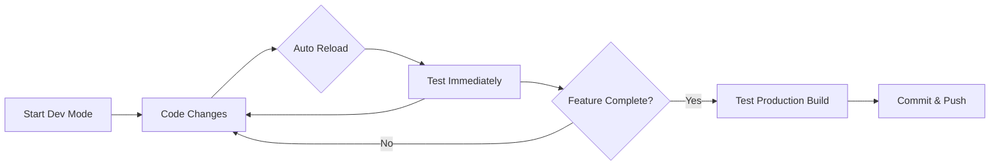

# Docker Compose: Development vs Production

## Quick Comparison

| Aspect | Development Mode | Production Mode |
|--------|-----------------|-----------------|
| **File** | `docker-compose.dev.yml` | `docker-compose.yml` |
| **Code Changes** | ✅ Auto-reload (instant) | ❌ Requires rebuild (~30s-2min) |
| **Hot Module Replacement** | ✅ Yes (Frontend) | ❌ No |
| **Build Time** | Fast (first time only) | Slow (every change) |
| **Container Size** | Large (dev dependencies) | Small (optimized) |
| **Use Case** | Daily development | Testing final build |
| **Speed** | ⚡ Instant feedback | 🐌 Rebuild for each change |

## Commands Cheat Sheet

### Development (Fast Iteration)
```bash
# Start dev environment
docker-compose -f docker-compose.dev.yml up -d

# Make code changes → They auto-reload! ✨

# Stop when done
docker-compose -f docker-compose.dev.yml down
```

### Production (Final Testing)
```bash
# Build and test production containers
docker-compose up --build -d

# Test everything works
docker ps
docker-compose logs -f

# Stop
docker-compose down
```

## When to Use Each

### Use Development Mode When:
- 👨‍💻 Building new features
- 🐛 Debugging issues
- 🧪 Testing code changes quickly
- 📝 Writing/updating documentation
- **Default for daily work**

### Use Production Mode When:
- ✅ Testing final build before deployment
- 📦 Validating Docker configurations
- 🔐 Testing production environment variables
- 🚀 Preparing for deployment
- **Only before commits/releases**

## Developer Workflow



**Bottom line:** Use `docker-compose.dev.yml` for 95% of your work!
