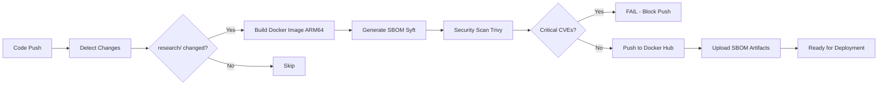

# 🚀 AI Security Collector - Automated Deployment Guide

This guide explains how to deploy the AI Security Collector using **automated GitHub Actions pipelines** (just like your app services).

---

## 🔄 Deployment Options

### **Option 1: GitHub Actions Pipeline (RECOMMENDED)**

Your AI collector now has its own CI/CD pipeline that automatically:
- ✅ Builds Docker image
- ✅ Scans for vulnerabilities (Trivy)
- ✅ Generates SBOM
- ✅ Pushes to Docker Hub
- ✅ Ready for ArgoCD deployment

**Trigger the pipeline:**

```bash
# Make any change to research/ directory
git add research/
git commit -m "feat: update AI collector"
git push origin main

# Or trigger manually from GitHub Actions UI
# Go to: Actions → "AI Security Collector - Build & Deploy" → Run workflow
```

**What happens:**
1. GitHub Actions detects `research/` changes
2. Builds `emiresh/ai-security-collector:v1.0.X` (ARM64 for your OCI cluster)
3. Scans with Trivy (fails if CRITICAL vulnerabilities found)
4. Pushes to Docker Hub
5. Ready to deploy!

**Check build status:**
```bash
# View in GitHub
https://github.com/YOUR_USERNAME/zero-trust-devsecops/actions

# Or get latest tag
LATEST_TAG=$(curl -s https://hub.docker.com/v2/repositories/emiresh/ai-security-collector/tags | jq -r '.results[0].name')
echo "Latest image: emiresh/ai-security-collector:$LATEST_TAG"
```

---

### **Option 2: Manual Docker Build (For Local Testing)**

Only use this for **local development/testing** before committing changes.

```bash
cd research

# Test locally first
./test_collector.sh

# Build image (if Docker Desktop is running)
docker build -t emiresh/ai-security-collector:dev .

# Push manually (for emergency hotfixes)
docker push emiresh/ai-security-collector:dev
```

---

## 📋 Prerequisites

Before first deployment, ensure you have:

### 1. Docker Hub Credentials in GitHub Secrets

Go to: **Settings → Secrets and variables → Actions → New repository secret**

Add these secrets:
- `DOCKER_USERNAME`: `emiresh`
- `DOCKER_PASSWORD`: Your Docker Hub access token

**Get Docker Hub access token:**
```bash
# Login to Docker Hub → Account Settings → Security → New Access Token
# Name it: "github-actions-zero-trust"
```

### 2. Kubernetes Namespace

```bash
# Create namespace (if not exists)
kubectl apply -f research/k8s/namespace.yaml

# Verify
kubectl get ns ai-security
```

### 3. Azure Credentials (Optional)

If using Azure AI features:
```bash
cd research
./setup_azure.sh

# This creates the `azure-ai-credentials` secret in Kubernetes
```

---

## 🚀 Deployment Steps

### **First Time Setup**

#### Step 1: Configure Falco Webhook

Edit Falco configuration to send events to AI collector:

```bash
# Edit this file
clusters/test-cluster/05-infrastructure/falco.yaml

# Find line ~150, change:
# FROM:
#   webhook:
#     address: ""

# TO:
#   webhook:
#     address: "http://ai-collector.ai-security:8000/events"
```

Commit and push:
```bash
git add clusters/test-cluster/05-infrastructure/falco.yaml
git commit -m "feat: connect Falco to AI collector webhook"
git push origin main
```

ArgoCD will auto-sync in ~1 minute.

#### Step 2: Trigger Pipeline Build

```bash
# Make a small change to trigger build
cd research
echo "# Automated build" >> README.md

git add README.md
git commit -m "feat: trigger AI collector build"
git push origin main
```

**Watch the build:**
```bash
# In GitHub UI
https://github.com/YOUR_USERNAME/zero-trust-devsecops/actions

# You'll see:
# 1. 🔍 Detect AI Collector Changes
# 2. 🏗️ Build & Scan AI Security Collector
# 3. 🚀 Deploy to Cluster
```

Build takes ~5-8 minutes:
- Building Docker image: 3-4 min
- Trivy security scan: 1-2 min
- Pushing to Docker Hub: 1-2 min

#### Step 3: Deploy to Cluster

After pipeline completes:

```bash
# Apply all manifests
kubectl apply -f research/k8s/

# Or use specific image version from pipeline
LATEST_TAG="v1.0.123"  # Get from GitHub Actions output
kubectl set image deployment/ai-security-collector \
  collector=emiresh/ai-security-collector:$LATEST_TAG \
  -n ai-security

# Verify deployment
kubectl get pods -n ai-security
kubectl logs -n ai-security deployment/ai-security-collector -f
```

Expected output:
```
INFO:     Started server process [1]
INFO:     Waiting for application startup.
INFO:     Application startup complete.
INFO:     Uvicorn running on http://0.0.0.0:8000
```

#### Step 4: Verify Data Collection

```bash
# Wait 2-3 minutes for Falco events to flow

# Check collector stats
kubectl exec -n ai-security deployment/ai-security-collector -- \
  curl -s http://localhost:8000/stats | jq

# Expected output:
{
  "total_events": 42,
  "events_by_priority": {
    "Warning": 38,
    "Error": 4
  },
  "uptime_seconds": 156,
  "storage_location": "/data/falco_events.jsonl"
}

# Check recent events
kubectl exec -n ai-security deployment/ai-security-collector -- \
  curl -s http://localhost:8000/events/recent?limit=3 | jq
```

#### Step 5: Trigger Test Event

```bash
# Trigger Falco alert by spawning shell in container
kubectl exec -it -n dev deployment/apigateway -- /bin/sh

# Exit immediately
exit

# Check collector received it (within 5 seconds)
kubectl logs -n ai-security deployment/ai-security-collector --tail=10

# Should see:
# Received Falco event: Shell Spawned in Container
# Stored event to /data/falco_events.jsonl
```

---

## 🔄 Updating the Collector

### Making Changes

```bash
cd research

# 1. Update code
vim collectors/falco_collector.py

# 2. Test locally
./test_collector.sh

# 3. Commit and push (triggers pipeline)
git add collectors/
git commit -m "feat: add event deduplication"
git push origin main

# 4. Pipeline runs automatically
# 5. New image: emiresh/ai-security-collector:v1.0.X

# 6. Deploy new version
kubectl rollout restart deployment/ai-security-collector -n ai-security

# 7. Watch rollout
kubectl rollout status deployment/ai-security-collector -n ai-security

# 8. Verify
kubectl logs -n ai-security deployment/ai-security-collector -f
```

---

## 📊 Pipeline Workflow Details

### What the Pipeline Does



### Security Gates

The pipeline **automatically fails** if:
- ❌ Critical vulnerabilities found (Trivy)
- ❌ Docker build fails
- ❌ Image push fails

### Build Matrix

| Branch | Image Tag | Platform | Purpose |
|--------|-----------|----------|---------|
| `main` | `v1.0.X` | ARM64 | Production release |
| `develop` | `dev-abc1234` | ARM64 | Development testing |
| Manual | Custom tag | ARM64 | Hotfix/testing |

---

## 🔍 Troubleshooting

### Pipeline Fails: "No such file or directory"

**Cause:** Trying to build from wrong directory

**Fix:** Ensure Dockerfile is in `research/` directory:
```bash
ls -la research/Dockerfile  # Should exist
```

### Pipeline Fails: "Critical vulnerabilities found"

**Cause:** Base image has CVEs

**Fix:** Update base image in Dockerfile:
```bash
# Edit research/Dockerfile
FROM python:3.12-slim  # Try newer version
```

### Pipeline Runs But Image Not Found

**Cause:** ArgoCD looking at wrong tag

**Fix:** Check image tag in deployment:
```bash
kubectl get deployment ai-security-collector -n ai-security -o yaml | grep image:

# Should match Docker Hub tag:
# emiresh/ai-security-collector:v1.0.123
```

### Collector Pod CrashLoopBackOff

**Cause:** Missing PVC or permissions

**Fix:**
```bash
# Check PVC
kubectl get pvc -n ai-security

# Check events
kubectl describe pod -n ai-security -l app=ai-security-collector

# Check logs
kubectl logs -n ai-security -l app=ai-security-collector --previous
```

---

## 📈 Monitoring Pipeline

### View Build Logs

```bash
# GitHub CLI (if installed)
gh run list --workflow=ai-collector-cicd.yml

# Get specific run logs
gh run view 1234567890

# Or in browser
https://github.com/YOUR_USERNAME/zero-trust-devsecops/actions
```

### Check Image Tags

```bash
# Docker Hub API
curl -s "https://hub.docker.com/v2/repositories/emiresh/ai-security-collector/tags" | jq -r '.results[] | "\(.name) - \(.last_updated)"'

# Or browse
https://hub.docker.com/r/emiresh/ai-security-collector/tags
```

### Verify Current Version

```bash
# Running in cluster
kubectl get deployment ai-security-collector -n ai-security -o=jsonpath='{.spec.template.spec.containers[0].image}'

# Should output:
# emiresh/ai-security-collector:v1.0.X
```

---

## 🎯 Next Steps After Deployment

1. **Verify data collection** (Week 1):
   ```bash
   # Check dataset growing
   kubectl exec -n ai-security deployment/ai-security-collector -- ls -lh /data/
   
   # Expected: falco_events.jsonl growing daily
   ```

2. **Collect normal baseline** (Weeks 2-4):
   - Let system run for 4 weeks
   - Target: 100K-1M events
   - No attacks yet!

3. **Run attack simulations** (Week 5):
   ```bash
   # Document in research/experiments/
   # Run 7 attack scenarios
   # Label data
   ```

4. **Train ML models** (Weeks 6-8):
   ```bash
   # Use collected data
   python research/modeling/train.py
   ```

5. **Evaluate and write** (Weeks 9-12):
   - Statistical tests
   - Thesis Chapter 5
   - Conference paper

---

## 📚 Related Documentation

- [AZURE_SETUP.md](AZURE_SETUP.md) - Azure AI Foundry setup
- [NEXT_STEPS.md](NEXT_STEPS.md) - Complete 12-week research timeline
- [README.md](README.md) - AI Security Control Plane overview
- [../docs/CICD-PIPELINE.md](../docs/CICD-PIPELINE.md) - General CI/CD architecture

---

## ✅ Deployment Checklist

Before marking deployment complete:

- [ ] GitHub Secrets configured (`DOCKER_USERNAME`, `DOCKER_PASSWORD`)
- [ ] Pipeline ran successfully (green checkmark in Actions)
- [ ] Image pushed to Docker Hub
- [ ] Namespace `ai-security` created
- [ ] Falco webhook configured in `falco.yaml`
- [ ] Deployment applied: `kubectl apply -f research/k8s/`
- [ ] Pod running: `kubectl get pods -n ai-security`
- [ ] Health check passing: `/health` returns 200
- [ ] Stats endpoint working: `/stats` returns JSON
- [ ] Test event received: Shell spawn detected
- [ ] Data file created: `/data/falco_events.jsonl` exists
- [ ] No errors in logs for 10 minutes
- [ ] ArgoCD synced (if using)

**Status:** Ready for 12-week data collection! 🎉

---

**Last Updated:** March 2, 2026
