# 🔄 GitOps Deployment with ArgoCD

Complete guide for automated deployment of AI Security Collector using **GitOps** with ArgoCD.

---

## 🎯 How It Works

```mermaid
graph LR
    A[Push Code] --> B[GitHub Actions]
    B --> C[Build Docker Image]
    C --> D[Security Scan Trivy]
    D --> E[Push to Docker Hub]
    E --> F[Update deployment.yaml]
    F --> G[Commit to Git]
    G --> H[ArgoCD Detects Change]
    H --> I[Auto-Sync to Cluster]
    I --> J[Pod Updated ✅]
```



**Fully automated**:
1. ✅ You push code
2. ✅ Pipeline builds + scans + pushes image
3. ✅ **Pipeline updates manifest with new tag**
4. ✅ **Pipeline commits manifest back to repo** `[skip ci]`
5. ✅ **ArgoCD auto-syncs** (within 3 min)
6. ✅ **Pod automatically updated!**

---

## 📋 One-Time Setup

### Step 1: Deploy ArgoCD Application

```bash
# Apply the ArgoCD Application manifest
kubectl apply -f clusters/test-cluster/10-apps/ai-collector-app.yaml

# Verify ArgoCD Application created
kubectl get application -n argocd ai-security-collector

# Check status
kubectl describe application -n argocd ai-security-collector
```

Expected output:
```
NAME                    SYNC STATUS   HEALTH STATUS
ai-security-collector   Synced        Healthy
```

### Step 2: Configure GitHub Secrets

Go to: https://github.com/emiresh/zero-trust-devsecops/settings/secrets/actions

Add these secrets:
- `DOCKER_USERNAME`: `emiresh`
- `DOCKER_PASSWORD`: Your Docker Hub access token

Get token: https://hub.docker.com/settings/security

### Step 3: Configure Falco Webhook (One-Time)

```bash
# Edit Falco config
vim clusters/test-cluster/05-infrastructure/falco.yaml

# Find line ~150, change:
# FROM:
#   webhook:
#     address: ""

# TO:
#   webhook:
#     address: "http://ai-collector.ai-security:8000/events"

# Commit
git add clusters/test-cluster/05-infrastructure/falco.yaml
git commit -m "feat: connect Falco to AI collector webhook"
git push origin main
```

ArgoCD will sync Falco config automatically!

---

## 🚀 Daily Workflow (Zero Manual Steps!)

### Making Changes

```bash
cd research

# 1. Make your changes
vim collectors/falco_collector.py

# 2. Test locally (optional)
./test_collector.sh

# 3. Commit and push
git add collectors/
git commit -m "feat: add event deduplication logic"
git push origin main

# DONE! Everything else is automatic.
```

### What Happens Automatically

**GitHub Actions (6-8 minutes):**
```
✅ Detects research/ changed
✅ Builds emiresh/ai-security-collector:v1.0.X (ARM64)
✅ Scans with Trivy (CRITICAL = fail ❌)
✅ Pushes to Docker Hub
✅ Updates research/k8s/deployment.yaml with new tag
✅ Commits back: "chore: update AI collector image to v1.0.X [skip ci]"
```

**ArgoCD (1-3 minutes):**
```
✅ Detects manifest change
✅ Compares cluster vs Git (out of sync)
✅ Auto-syncs new deployment
✅ Kubernetes updates pod with new image
✅ Health check passes
✅ ArgoCD status: Synced + Healthy
```

**Total time:** ~10 minutes from `git push` to deployed! 🚀

---

## 📊 Monitor the Deployment

### Watch GitHub Actions

```bash
# Browser
https://github.com/emiresh/zero-trust-devsecops/actions

# CLI (if gh installed)
gh run watch

# View logs
gh run view --log
```

### Watch ArgoCD

```bash
# ArgoCD UI
kubectl port-forward svc/argocd-server -n argocd 8080:443
# Open: https://localhost:8080

# CLI
kubectl get application -n argocd ai-security-collector -w

# Sync status
argocd app get ai-security-collector
```

### Watch Kubernetes

```bash
# Watch pod updates
kubectl get pods -n ai-security -w

# Watch deployment rollout
kubectl rollout status deployment/ai-security-collector -n ai-security

# Check new image version
kubectl get deployment ai-security-collector -n ai-security \
  -o jsonpath='{.spec.template.spec.containers[0].image}'

# Expected: emiresh/ai-security-collector:v1.0.X
```

### Check Collector Logs

```bash
# Follow logs
kubectl logs -n ai-security deployment/ai-security-collector -f

# Check recent events received
kubectl exec -n ai-security deployment/ai-security-collector -- \
  curl -s localhost:8000/stats | jq

# Verify new version deployed
kubectl exec -n ai-security deployment/ai-security-collector -- \
  curl -s localhost:8000/health | jq
```

---

## 🔍 Verify Full Flow End-to-End

### Test 1: Trigger Pipeline

```bash
cd research

# Make trivial change
echo "# Updated $(date)" >> README.md

git add README.md
git commit -m "test: trigger GitOps deployment"
git push origin main
```

**Watch:**
1. GitHub Actions: https://github.com/emiresh/zero-trust-devsecops/actions
2. Wait for "Update Deployment Manifest (GitOps)" stage
3. Check new commit appears (automated):
   ```bash
   git pull
   git log -1 --oneline
   # Should see: "chore: update AI collector image to v1.0.X [skip ci]"
   ```

4. ArgoCD syncs:
   ```bash
   kubectl get application -n argocd ai-security-collector
   # SYNC STATUS should change: OutOfSync → Syncing → Synced
   ```

5. Pod updated:
   ```bash
   kubectl get pods -n ai-security
   # Should see pod restart with new image
   ```

### Test 2: Verify Image Tag

```bash
# Get latest tag from Docker Hub
LATEST_TAG=$(curl -s https://hub.docker.com/v2/repositories/emiresh/ai-security-collector/tags | jq -r '.results[0].name')
echo "Latest Docker Hub image: $LATEST_TAG"

# Get tag from Git manifest
MANIFEST_TAG=$(grep "image: emiresh/ai-security-collector:" research/k8s/deployment.yaml | grep -oP '(?<=:).*')
echo "Git manifest tag: $MANIFEST_TAG"

# Get tag running in cluster
CLUSTER_TAG=$(kubectl get deployment ai-security-collector -n ai-security -o jsonpath='{.spec.template.spec.containers[0].image}' | grep -oP '(?<=:).*')
echo "Cluster running tag: $CLUSTER_TAG"

# All three should match!
if [[ "$LATEST_TAG" == "$MANIFEST_TAG" && "$MANIFEST_TAG" == "$CLUSTER_TAG" ]]; then
  echo "✅ GitOps working perfectly! All tags match: $LATEST_TAG"
else
  echo "⚠️  Tags don't match - check ArgoCD sync status"
fi
```

### Test 3: Trigger Falco Event

```bash
# Trigger shell spawn event
kubectl exec -it -n dev deployment/apigateway -- /bin/sh
exit

# Check collector received it (within 5 seconds)
kubectl logs -n ai-security deployment/ai-security-collector --tail=20 | grep -i "shell"

# Should see:
# Received Falco event: Shell Spawned in Container
# Stored event to /data/falco_events.jsonl
```

---

## 🎯 GitOps Files Overview

| File | Purpose | Updated By |
|------|---------|------------|
| `clusters/test-cluster/10-apps/ai-collector-app.yaml` | **ArgoCD Application** | You (manual) |
| `research/k8s/deployment.yaml` | **Kubernetes Deployment** | Pipeline (automatic) |
| `research/k8s/deployment-with-azure.yaml` | Deployment with Azure | Pipeline (automatic) |
| `research/k8s/namespace.yaml` | Namespace definition | You (manual) |
| `research/k8s/service.yaml` | Service definition | You (manual) |

**Key insight:**
- You never manually edit `deployment.yaml` image tags!
- Pipeline commits new tags automatically
- ArgoCD syncs automatically
- You only edit configuration/code

---

## 🔄 Deployment Workflows

### Workflow 1: Normal Development

```bash
# 1. Make code changes
vim research/collectors/falco_collector.py

# 2. Push to main
git add research/
git commit -m "feat: improved error handling"
git push origin main

# 3. Wait 10 minutes
# - GitHub Actions: 6-8 min
# - ArgoCD sync: 1-3 min

# 4. Verify deployed
kubectl logs -n ai-security deployment/ai-security-collector -f
```

### Workflow 2: Hotfix (Same Process!)

```bash
# 1. Fix critical bug
vim research/collectors/falco_collector.py

# 2. Push
git add research/
git commit -m "fix: resolve memory leak in event storage"
git push origin main

# 3. Pipeline runs same as normal
# No special hotfix process needed!
```

### Workflow 3: Rollback

```bash
# Option 1: Git revert (GitOps way)
git revert HEAD  # Reverts last commit
git push origin main
# ArgoCD auto-syncs to previous version

# Option 2: ArgoCD rollback
argocd app rollback ai-security-collector

# Option 3: Manual manifest edit
git checkout HEAD~1 research/k8s/deployment.yaml
git commit -m "rollback: revert to previous version"
git push origin main
```

### Workflow 4: Manual Sync (Emergency)

```bash
# Force sync via ArgoCD CLI
argocd app sync ai-security-collector

# Or via kubectl
kubectl patch application ai-security-collector -n argocd \
  --type merge -p '{"operation":{"initiatedBy":{"username":"admin"},"sync":{}}}'

# Or via UI
# ArgoCD UI → Applications → ai-security-collector → SYNC
```

---

## 🛠️ Troubleshooting

### ArgoCD App Shows "OutOfSync"

**Check what's different:**
```bash
argocd app diff ai-security-collector

# View details
kubectl describe application ai-security-collector -n argocd
```

**Force sync:**
```bash
argocd app sync ai-security-collector --force
```

### Pipeline Commits But ArgoCD Doesn't Sync

**Check ArgoCD sync settings:**
```bash
kubectl get application ai-security-collector -n argocd -o yaml | grep -A 10 syncPolicy
```

Should show:
```yaml
syncPolicy:
  automated:
    prune: true
    selfHeal: true
```

**Check ArgoCD polling:**
```bash
# ArgoCD polls Git every 3 minutes by default
# Wait up to 3 minutes, or force sync:
argocd app sync ai-security-collector
```

### Image Tag in Manifest Doesn't Match Cluster

**Cause:** ArgoCD out of sync

**Fix:**
```bash
# Check if ArgoCD needs sync
kubectl get application ai-security-collector -n argocd

# Force sync
argocd app sync ai-security-collector

# Or delete and recreate pod
kubectl delete pod -n ai-security -l app=ai-security-collector
```

### Pipeline Fails: "Failed to push commit"

**Cause:** GitHub token doesn't have write access

**Fix:** Pipeline uses `${{ secrets.GITHUB_TOKEN }}` which has write access by default. Check:
```bash
# Ensure workflow has permissions:
# In .github/workflows/ai-collector-cicd.yml:
permissions:
  contents: write  # This allows commits
```

### Multiple Commits in Quick Succession

**Behavior:** Each push triggers pipeline → new image → new commit → **doesn't trigger again** (because `[skip ci]`)

This is **correct** and prevents infinite loops!

---

## 📈 Best Practices

### 1. Never Manually Edit Manifests

❌ **Don't do this:**
```bash
vim research/k8s/deployment.yaml  # Change image tag
git push
```

✅ **Do this instead:**
```bash
# Let pipeline update image tags
# You only change config/code
```

### 2. Use Semantic Commits

```bash
git commit -m "feat: add new feature"     # Feature
git commit -m "fix: resolve bug"          # Bugfix
git commit -m "chore: update dependency"  # Maintenance
git commit -m "docs: update README"       # Documentation
```

### 3. Monitor ArgoCD Health

```bash
# Add to monitoring dashboard
kubectl get application -n argocd ai-security-collector \
  -o jsonpath='{.status.health.status}'

# Should return: Healthy
```

### 4. Review Pipeline Logs

```bash
# Before merging to main, check:
# - Security scan results
# - SBOM generation
# - Image push success
```

---

## 📊 Comparison: Manual vs GitOps

| Task | Manual Deployment | GitOps with ArgoCD |
|------|-------------------|-------------------|
| Build image | `docker build` locally | ✅ GitHub Actions |
| Security scan | Manual (if remembered) | ✅ Automated (Trivy) |
| Push image | `docker push` | ✅ Automated |
| Update manifest | Edit YAML manually | ✅ Pipeline updates |
| Deploy | `kubectl apply` | ✅ ArgoCD auto-syncs |
| Rollback | Remember old tag | ✅ Git revert |
| Audit trail | None | ✅ Full Git history |
| Consistency | Drift over time | ✅ Git is source of truth |
| **Time to deploy** | **15-20 min** | **10 min (fully automated)** |

---

## ✅ GitOps Deployment Checklist

### Initial Setup (One-Time)
- [ ] ArgoCD Application created: `kubectl apply -f clusters/test-cluster/10-apps/ai-collector-app.yaml`
- [ ] GitHub Secrets configured: `DOCKER_USERNAME`, `DOCKER_PASSWORD`
- [ ] Falco webhook configured: Points to `http://ai-collector.ai-security:8000/events`
- [ ] Namespace exists: `kubectl get ns ai-security`
- [ ] ArgoCD shows Synced + Healthy

### Every Deployment
- [ ] Code changes committed to `research/`
- [ ] Pushed to `main` branch
- [ ] GitHub Actions pipeline passed (green checkmark)
- [ ] New image tag on Docker Hub
- [ ] Manifest updated with `[skip ci]` commit
- [ ] ArgoCD detected change (OutOfSync → Syncing → Synced)
- [ ] Pod restarted with new image
- [ ] Health check passing
- [ ] Collector receiving Falco events

---

## 🎉 Summary

You now have **full GitOps deployment** for the AI Security Collector:

✅ **Single Source of Truth**: Git repo  
✅ **Automated CI/CD**: Build → Scan → Push → Update → Deploy  
✅ **Zero Manual Steps**: `git push` and done  
✅ **Security Gates**: Trivy blocks critical CVEs  
✅ **Audit Trail**: Every change tracked in Git  
✅ **Self-Healing**: ArgoCD keeps cluster in sync with Git  
✅ **Easy Rollback**: `git revert` to undo  

**Same workflow as your application services** - Professional level! 🚀

---

**Next:** Commit the ArgoCD Application and watch the magic happen!

```bash
git add clusters/test-cluster/10-apps/ai-collector-app.yaml
git add .github/workflows/ai-collector-cicd.yml
git commit -m "feat: enable GitOps deployment for AI collector"
git push origin main
```
