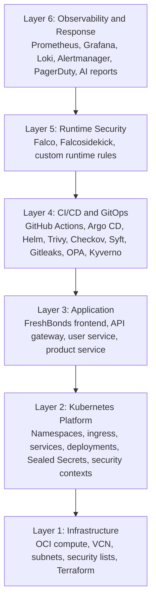
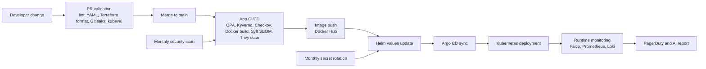
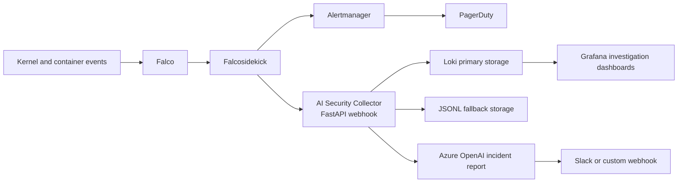
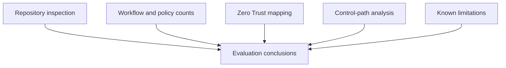

# Automating Continuous Compliance in DevSecOps Through Zero Trust

**Final Project Report**

**Author:** Iresh Emalsha  
**Programme:** Master of Information Systems  
**Project Weighting:** 5 Credits  
**Institution:** [University Name]  
**Department:** [Department Name]  
**Supervisor:** [Supervisor Name]  
**Date:** April 2026  

---

## Declaration

I declare that this final report is my own work and that the implementation, analysis, and written discussion are based on the Zero-Trust DevSecOps project contained in the `zero-trust-devsecops` repository. All external sources used to support the background, related work, and technical discussion are cited in the text and listed in the references using Harvard style. Repository artefacts such as workflow files, Kubernetes manifests, Terraform definitions, policy files, and service implementations are used as project evidence.

## Acknowledgements

I would like to thank my supervisor, lecturers, and peers for their guidance and feedback throughout the project. I also acknowledge the maintainers of the open-source tools used in the implementation, including Kubernetes, Open Policy Agent, Kyverno, Falco, Trivy, Checkov, Syft, Sealed Secrets, Prometheus, Grafana, Loki, and Argo CD.

---

## Abstract

Cloud-native application teams can deploy containerised microservices faster than traditional compliance teams can manually verify infrastructure, application, and runtime security controls. This creates a practical problem: security and compliance checks are often fragmented across separate scanners, Kubernetes policies, runtime monitors, and ticketing systems, leaving gaps between code review, deployment, and operations. This project addresses that problem by designing and implementing a Zero-Trust DevSecOps framework for a Kubernetes-based FreshBonds microservices application. The approach uses design science research to construct and evaluate an artefact that combines GitOps, infrastructure as code, policy as code, container vulnerability scanning, automated secret rotation, runtime threat detection, and AI-assisted incident reporting. The system is implemented with four application services, six GitHub Actions workflows, Terraform-based Oracle Cloud Infrastructure provisioning, Helm and Argo CD deployment, Kyverno and OPA policy checks, Falco runtime rules, Prometheus/Grafana/Loki observability, PagerDuty alerting, and an Azure OpenAI based AI Security Collector.

The major finding is that continuous compliance can be operationalised as a set of automated control points across the delivery lifecycle rather than as a periodic manual audit. Repository investigation confirms 9 Kyverno rules, 16 OPA checks, 13 custom Falco runtime rules, 22 Prometheus alerting rules, 6 CI/CD workflows, dual-format SBOM generation, monthly secret rotation, and security scan artefact upload. The project demonstrates strong coverage of NIST Zero Trust principles, especially least privilege, continuous monitoring, dynamic policy enforcement, and auditability. The main limitations are that formal red-team testing, multi-cluster validation, service mesh mutual TLS, and quantitative performance benchmarking are outside the current five-credit scope. The contribution is a reproducible MIS-level reference implementation that shows how Zero Trust can be translated from a conceptual security model into concrete DevSecOps automation for Kubernetes.

**Keywords:** Zero Trust, DevSecOps, continuous compliance, Kubernetes, GitOps, policy as code, Falco, Trivy, Kyverno, Open Policy Agent, Sealed Secrets, AI security monitoring.

---

## Table of Contents

1. [Introduction](#1-introduction)  
2. [Related Work](#2-related-work)  
3. [Approach](#3-approach)  
4. [Design and Implementation](#4-design-and-implementation)  
5. [Evaluation](#5-evaluation)  
6. [Discussion](#6-discussion)  
7. [Conclusion and Future Work](#7-conclusion-and-future-work)  
8. [Contribution and Novelty](#8-contribution-and-novelty)  
9. [References](#9-references)  
10. [Appendices](#10-appendices)  

## List of Figures

**Figure 1.** Six-layer Zero-Trust DevSecOps architecture  
**Figure 2.** CI/CD and GitOps compliance control flow  
**Figure 3.** Runtime monitoring and AI enrichment flow  
**Figure 4.** Evaluation model used for the project  

## List of Tables

**Table 1.** Scope of the five-credit MIS project  
**Table 2.** Literature review taxonomy  
**Table 3.** Critical comparison of related approaches and project novelty  
**Table 4.** Systematic implementation approach  
**Table 5.** Major implementation artefacts identified in the repository  
**Table 6.** Security tool integration matrix  
**Table 7.** Evaluation setup and evidence sources  
**Table 8.** NIST SP 800-207 Zero Trust mapping  
**Table 9.** Policy and monitoring coverage verified from the repository  
**Table 10.** Security gate evaluation results  
**Table 11.** Limitations and future work  

---

## List of Abbreviations

**AI:** Artificial Intelligence  
**API:** Application Programming Interface  
**C2:** Command and Control  
**CI/CD:** Continuous Integration and Continuous Delivery  
**CNCF:** Cloud Native Computing Foundation  
**CSP:** Content Security Policy  
**CVE:** Common Vulnerabilities and Exposures  
**DAST:** Dynamic Application Security Testing  
**DSRM:** Design Science Research Methodology  
**IaC:** Infrastructure as Code  
**IAST:** Interactive Application Security Testing  
**JWT:** JSON Web Token  
**LLM:** Large Language Model  
**MIS:** Master of Information Systems  
**MTTU:** Mean Time to Understand  
**OPA:** Open Policy Agent  
**OCI:** Oracle Cloud Infrastructure  
**RBAC:** Role-Based Access Control  
**SAST:** Static Application Security Testing  
**SBOM:** Software Bill of Materials  
**SCA:** Software Composition Analysis  
**SOC:** Security Operations Centre  
**ZTA:** Zero Trust Architecture  

---

## 1. Introduction

### 1.1 General Introduction to the Problem

Cloud-native systems have changed the way software is built, deployed, and operated. Instead of deploying a single monolithic application to a small number of servers, modern teams commonly deliver multiple services as containers and run them on Kubernetes, an architectural direction influenced by large-scale container orchestration experience such as Borg, Omega, and Kubernetes (Burns et al., 2016). This approach improves scalability, resilience, and delivery speed, but it also increases the number of assets that must be secured. Each container image, Kubernetes manifest, infrastructure change, CI/CD workflow, secret, network path, and runtime process becomes part of the compliance boundary.

Traditional security models are not well suited to this environment. Perimeter-based security assumes that systems inside a trusted network boundary can be treated as safer than systems outside the boundary. Zero Trust rejects this assumption and instead requires continuous verification, least privilege, dynamic policy enforcement, and monitoring of asset security posture (Rose et al., 2020). DevSecOps provides the operational mechanism for this idea by embedding security controls into the software delivery lifecycle rather than treating security as a separate final approval stage (OWASP, 2023).

The practical problem addressed by this project is that Zero Trust and DevSecOps are often discussed as principles, but students and practitioners still need concrete implementation patterns. A typical team may have a vulnerability scanner in CI, a few Kubernetes policies in the cluster, manual secret rotation, and separate monitoring dashboards. However, these controls do not automatically produce continuous compliance unless they are integrated into a systematic lifecycle. The FreshBonds project therefore implements a complete, repository-driven example of continuous compliance for a Kubernetes microservices application.

### 1.2 Problem Statement

The main problem is the absence of an integrated, reproducible, and evidence-generating security workflow for cloud-native microservices. In many systems:

1. Security checks are fragmented across different tools and stages.
2. Compliance verification is performed periodically instead of continuously.
3. Infrastructure, application, and runtime controls are not mapped back to Zero Trust principles.
4. Secrets are difficult to manage safely in GitOps workflows.
5. Runtime alerts may lack enough context for quick security triage.

This project investigates how these issues can be addressed by implementing automated controls across infrastructure, CI/CD, Kubernetes admission policy, runtime monitoring, observability, and incident reporting.

### 1.3 Project Aim and Objectives

The aim of this project is to design, implement, and evaluate a Zero-Trust DevSecOps framework that automates continuous compliance for a Kubernetes-based microservices application.

The objectives are:

1. To design a cloud-native architecture that maps infrastructure, application, CI/CD, runtime, and observability controls to Zero Trust principles.
2. To implement secure microservices and deployment manifests for the FreshBonds application.
3. To automate security gates using GitHub Actions, Trivy, Checkov, Gitleaks, Syft, OPA/Conftest, Kyverno CLI, npm audit, and Kubernetes validation.
4. To implement GitOps deployment using Helm and Argo CD with encrypted secrets managed through Bitnami Sealed Secrets (Bitnami Labs, 2026).
5. To add runtime detection using Falco, operational monitoring using Prometheus/Grafana/Loki, and incident alerting using PagerDuty.
6. To develop an AI Security Collector that receives Falco events, stores them in Loki or JSONL fallback storage, and enriches selected events through Azure OpenAI (Microsoft, 2026).
7. To evaluate the implementation against Zero Trust principles, policy coverage, security gate behaviour, and repository evidence.

### 1.4 Scope of the Project

The project scope is intentionally sized for a five-credit MIS final project. It focuses on the design, implementation, integration, and evidence-based evaluation of a working security automation framework rather than on building a large commercial system or running a long-duration industrial experiment.

**Table 1. Scope of the five-credit MIS project**

| Area | Included in Scope | Excluded from Scope |
|---|---|---|
| Application | FreshBonds microservices with frontend, API gateway, user service, and product service | Full commercial e-commerce features |
| Infrastructure | Terraform definitions for OCI networking and compute resources | Multi-cloud provisioning |
| Kubernetes | Helm chart, Argo CD application manifests, namespaces, ingress, secrets, monitoring stack | Multi-cluster federation |
| CI/CD | Six GitHub Actions workflows for PR validation, application CI/CD, Terraform, security scanning, secret rotation, and AI collector CI/CD | Enterprise change-advisory workflows |
| Policy | Kyverno and OPA policy checks for pod security, image policy, resource limits, and network-policy-related checks | Full organisation-wide policy library |
| Runtime monitoring | Falco custom rules, Falcosidekick routing, Prometheus alert rules, PagerDuty integration | Formal SOC workflow integration |
| AI component | Azure OpenAI based incident report generation for selected Falco events | Training new anomaly detection models |
| Evaluation | Repository evidence, control mapping, rule counts, workflow inspection, and design evaluation | Formal penetration test and load benchmark |

Table 1 shows that the project is broad enough to demonstrate a complete MIS security automation solution but constrained enough to remain feasible within the credit allocation.

### 1.5 Research Questions

The report addresses the following research questions:

**RQ1:** How can Zero Trust principles be implemented across the delivery lifecycle of a Kubernetes microservices system?

**RQ2:** What CI/CD and GitOps control points are suitable for automating continuous compliance in a small cloud-native project?

**RQ3:** How can policy-as-code and runtime detection be combined so that security is enforced before and after deployment?

**RQ4:** How does an AI-assisted runtime reporting component improve the usefulness of raw security events?

### 1.6 Report Structure

Section 2 reviews related work and positions the project against existing approaches. Section 3 explains the systematic approach and design science method. Section 4 presents the system design and implementation. Section 5 evaluates the project using repository evidence and Zero Trust mapping. Section 6 discusses how the results address the original problem. Section 7 concludes the report and identifies future work. Section 8 summarises the contribution and novelty.

---

## 2. Related Work

### 2.1 Literature Review Structure

The literature review is organised as a taxonomy rather than as a chronological list. This is suitable because the project integrates several technical areas: Zero Trust, DevSecOps, continuous compliance, Kubernetes policy, software supply chain security, runtime monitoring, GitOps, and AI-assisted security operations.

**Table 2. Literature review taxonomy**

| Theme | Key Idea | Relevance to Project |
|---|---|---|
| Zero Trust Architecture | No implicit trust, continuous verification, least privilege, dynamic policy, monitoring of asset posture (Rose et al., 2020) | Provides the security principles used to evaluate the system |
| DevSecOps | Security is integrated into development, build, deployment, and runtime operations (OWASP, 2023) | Provides the lifecycle model for automated security gates |
| Design science | Build and evaluate an artefact to solve an identified organisational or technical problem (Hevner et al., 2004; Peffers et al., 2007) | Provides the research method used in the project |
| Kubernetes security | Admission control, pod security standards, workload isolation, RBAC, and secure configuration are needed for container platforms (Kubernetes, 2026) | Guides Kyverno, OPA, and security-context implementation |
| Policy as code | Policies are expressed as machine-readable rules and evaluated automatically (Open Policy Agent, 2026; Kyverno, 2026) | Enables CI/CD and deploy-time policy checks |
| Supply chain security | Container scanning and SBOMs improve transparency of dependencies and images (Aqua Security, 2026; Anchore, 2026) | Supports Trivy vulnerability scanning and Syft SBOM generation |
| Infrastructure security | IaC scanning can detect insecure cloud or Kubernetes configurations before deployment (Bridgecrew, 2026) | Supports Checkov validation for Terraform, Dockerfile, and Kubernetes manifests |
| Runtime security | eBPF and syscall monitoring can detect behaviour that static scans cannot detect (Falco, 2026) | Supports Falco runtime detection and alerting |
| Threat taxonomy | MITRE ATT&CK for Containers gives a structured vocabulary for container threat coverage (MITRE, 2026) | Helps map Falco rules to adversary techniques |

Table 2 demonstrates that the project combines multiple established areas instead of relying on one security tool.

### 2.2 Zero Trust and DevSecOps

Zero Trust Architecture is defined by NIST as an approach in which trust is never assumed only because a resource is inside a network boundary. Access decisions should be based on identity, context, policy, and continuous monitoring (Rose et al., 2020). In a Kubernetes setting, this requires each workload and configuration artefact to be treated as a resource that must be controlled.

DevSecOps complements Zero Trust by embedding security checks into the software delivery lifecycle. DevSecOps literature identifies this integration of development, operations, and security as a response to late-stage security review bottlenecks (Myrbakken and Colomo-Palacios, 2017). OWASP (2023) describes DevSecOps as an approach where security is integrated into planning, development, build, testing, deployment, and monitoring. NIST's Secure Software Development Framework also supports repeatable security practices across the software lifecycle (Souppaya, Scarfone and Dodson, 2022). This aligns with the FreshBonds project, where the security model is not a separate document but a working set of pipeline gates, Kubernetes policies, runtime rules, alerting flows, and audit logs.

Continuous software engineering literature also shows why periodic compliance reviews are insufficient for high-frequency software delivery (Fitzgerald and Stol, 2017). For microservice environments, NIST further highlights the need to integrate secure development practices with deployment and service communication controls (Souppaya, Scarfone and Morello, 2023).

### 2.3 Kubernetes Policy and Admission Control

Kubernetes supports policy enforcement through resource specifications, admission controllers, RBAC, network policies, and pod security controls (Kubernetes, 2026). However, native Kubernetes controls are often too low-level for project teams to manage consistently. Tools such as OPA and Kyverno provide higher-level policy abstractions.

OPA uses the Rego policy language and can be applied in CI/CD through Conftest or inside Kubernetes through Gatekeeper (Open Policy Agent, 2026). Kyverno is Kubernetes-native and uses YAML policies that validate, mutate, generate, or clean resources (Kyverno, 2026). In this project, both are used because they have complementary strengths. OPA is useful for general policy logic in CI/CD, while Kyverno is easier to express as Kubernetes-native validation rules.

### 2.4 Supply Chain and Infrastructure Security

Containerised systems depend on base images, operating system packages, language packages, Dockerfiles, and Kubernetes manifests. Vulnerabilities may enter the system at any of these levels. Trivy is used to scan container images and libraries for known vulnerabilities (Aqua Security, 2026). Syft is used to generate SBOMs, allowing deployed images to be traced back to their components (Anchore, 2026). Checkov is used to identify infrastructure-as-code misconfiguration across Terraform, Kubernetes, and Dockerfile definitions (Bridgecrew, 2026).

This is important for continuous compliance because a deployment that was safe at the time of release may become non-compliant later when a new CVE is published. The scheduled security scan workflow addresses this by rescanning production images and dependencies monthly.

### 2.5 Runtime Monitoring and AI-Assisted Security Operations

Static scanning cannot detect every security issue. A container image may pass vulnerability checks and still be compromised at runtime. Falco addresses this by monitoring Linux system calls through kernel instrumentation and detecting suspicious behaviours such as shell execution, sensitive file access, package installation, network reconnaissance, and crypto-mining behaviours (Falco, 2026).

Runtime detection creates another problem: raw alerts can be difficult to prioritise. The AI Security Collector in this project receives Falco events through Falcosidekick and can generate concise incident narratives using Azure OpenAI. This does not replace human judgement, but it provides a practical first-level explanation of what happened, why it matters, and what should be investigated.

### 2.6 Similar Work and Novelty

The project is not novel because it invents a new security scanner or policy engine. Its novelty is in the integration pattern and in the evidence-driven implementation of continuous compliance across the whole delivery lifecycle.

**Table 3. Critical comparison of related approaches and project novelty**

| Related Approach | Typical Strength | Typical Limitation | Project Response |
|---|---|---|---|
| Standalone vulnerability scanning | Finds CVEs in images or dependencies | Does not enforce Kubernetes policy or runtime behaviour | Trivy and npm audit are integrated with CI/CD gates and scheduled rescans |
| Standalone Kubernetes admission policy | Blocks insecure resource definitions | Does not verify application dependencies or runtime execution | Kyverno and OPA are combined with Trivy, Checkov, Gitleaks, and Falco |
| Periodic compliance audit | Produces formal compliance evidence | Can miss drift between audit periods | GitHub Actions, Argo CD, scheduled scans, and rotation logs produce continuous evidence |
| Runtime-only security monitoring | Detects suspicious behaviour after deployment | Cannot prevent insecure builds from reaching production | Falco is used alongside build-time and deploy-time controls |
| GitOps without secret lifecycle automation | Improves deployment traceability | Secrets may be excluded from Git or rotated manually | Sealed Secrets allows encrypted secret manifests and monthly rotation |
| AI-only security triage | Can summarise alerts | Depends on good event context and can hallucinate if uncontrolled | AI is used only as enrichment; Falco, Loki, and PagerDuty remain the core control path |

As shown in Table 3, the contribution is a joined-up design: preventive, detective, and corrective evidence is connected into a single DevSecOps lifecycle.

---

## 3. Approach

### 3.1 Systematic Approach

The project follows Design Science Research Methodology (DSRM), which is appropriate because the goal is to build and evaluate an artefact that addresses a practical information systems problem (Hevner et al., 2004; Peffers et al., 2007). The artefact is the Zero-Trust DevSecOps framework implemented in the repository.

**Table 4. Systematic implementation approach**

| DSRM Activity | Project Application | Justification |
|---|---|---|
| Problem identification | Fragmented security and manual compliance in Kubernetes microservices | Establishes why automation is needed |
| Objectives of a solution | Continuous compliance, Zero Trust mapping, audit evidence, runtime visibility | Defines measurable project outcomes |
| Design and development | Build FreshBonds architecture, pipelines, policies, runtime monitoring, and AI collector | Produces a working artefact rather than only a conceptual model |
| Demonstration | Apply the framework to the FreshBonds microservices repository and Kubernetes manifests | Shows feasibility in a realistic project setting |
| Evaluation | Inspect repository evidence, map controls to Zero Trust, verify rule and workflow coverage | Provides proof aligned with MIS project scope |
| Communication | Produce final report, diagrams, tables, and appendices | Communicates the artefact and its evaluation |

Table 4 shows that the approach is systematic and justified. The project does not merely install tools; it links tools to objectives and evaluates their coverage.

### 3.2 Design Principles

The following design principles guided the implementation:

1. **Shift left without stopping at shift-left.** Security checks should run early in PR and CI/CD workflows, but runtime monitoring is still required.
2. **Use Git as the compliance evidence source.** Infrastructure, policies, Helm values, encrypted secrets, rotation logs, and workflows are versioned.
3. **Prefer automated gates for repeatable checks.** CVE thresholds, secret detection, IaC checks, and policy checks should be automated.
4. **Keep runtime alerting independent of AI.** AI enrichment improves understanding, but core alerting must still work if Azure OpenAI is unavailable.
5. **Use layered controls.** Infrastructure, container, Kubernetes, application, pipeline, and runtime controls should reduce the chance that one missed check causes complete security failure.

### 3.3 Evaluation Criteria

The evaluation uses the following criteria:

1. Coverage of NIST SP 800-207 Zero Trust principles.
2. Evidence of working security gates in CI/CD workflows.
3. Policy coverage across Kyverno, OPA, and Falco.
4. Secure configuration of microservices and containers.
5. Secret management and auditability.
6. Runtime monitoring and incident response flow.
7. Limitations and future work required to mature the framework.

---

## 4. Design and Implementation

### 4.1 Architecture Overview

The system is implemented as a six-layer architecture. The layers are infrastructure, Kubernetes platform, application services, CI/CD and GitOps, runtime security, and observability.



**Figure 1. Six-layer Zero-Trust DevSecOps architecture**

Figure 1 shows the defence-in-depth design. The system does not rely on a single point of enforcement. For example, a vulnerable image can be blocked during CI/CD, an insecure manifest can be rejected by policy checks, and suspicious behaviour that escapes earlier checks can be detected by Falco at runtime.

### 4.2 Application Design

The FreshBonds application is composed of four services:

1. **Frontend:** React 18 and Vite application served by nginx.
2. **API gateway:** Express.js gateway that proxies user and product service requests and handles payment initiation logic.
3. **User service:** Express.js and MongoDB service that provides registration, login, JWT handling, role-based access, password hashing, validation, and account security checks.
4. **Product service:** Express.js and MongoDB service that manages product records, farmer ownership checks, admin visibility controls, and product validation.

The Node.js services use Helmet security headers, CORS configuration, JSON body limits, health endpoints, and container health checks. The user and product services connect to MongoDB Atlas using environment-provided secrets. JWTs are used for authenticated requests, and service-specific middleware implements role and ownership controls.

### 4.3 Infrastructure and Kubernetes Design

The infrastructure layer is defined in Terraform under the `terraform/` directory. Repository inspection identified 12 Terraform files that define OCI provider configuration, VCN, subnets, route tables, gateway resources, security list rules, compute instances, backend state, outputs, and variables. The instance configuration defines a control-plane node with a public IP and two worker nodes in the private subnet. IMDS legacy endpoints are disabled in the instance definitions, and boot volume encryption in transit is enabled through launch options.

The Kubernetes application layer is defined through the Helm chart under `apps/freshbonds/`. The values file defines four deployments, two replicas for the application services, service ports, liveness and readiness probes, resource requests and limits, read-only root filesystem settings, non-root execution, and capability dropping. Secrets are provided through `freshbonds-secret`, which is managed as a SealedSecret rather than as plaintext.

### 4.4 CI/CD and GitOps Design

The repository contains six GitHub Actions workflows:

1. `pr-validation.yml`
2. `app-cicd.yml`
3. `terraform.yml`
4. `security-scan.yml`
5. `secret-rotation.yml`
6. `ai-collector-cicd.yml`



**Figure 2. CI/CD and GitOps compliance control flow**

Figure 2 shows how compliance evidence is generated at different times. PR validation gives fast feedback before merge. Application CI/CD applies deeper checks before deployment. Scheduled security scans detect vulnerabilities discovered after deployment. Secret rotation updates encrypted secrets and lets Argo CD reconcile the cluster.

### 4.5 Policy-as-Code Design

The policy-as-code implementation uses both Kyverno and OPA.

Kyverno policies are defined in:

1. `policies/kyverno/pod-security.yaml`
2. `policies/kyverno/image-verification.yaml`

These files contain 9 verified Kyverno rules covering non-root execution, privileged container prevention, resource limits, capability dropping, privilege escalation prevention, read-only root filesystem, latest-tag prevention, approved image registries, and image pull policy.

OPA policies are defined in:

1. `policies/opa/security.rego`
2. `policies/opa/network.rego`

These files contain 16 verified OPA deny or warn checks covering root execution, privileged containers, resource limits, readiness and liveness probes, privilege escalation, image tag policy, approved registry checks, hostPath volume denial, read-only root filesystem warnings, capability restrictions, NetworkPolicy expectations, and service configuration warnings.

### 4.6 Runtime Security and Observability Design

Runtime monitoring is implemented through Falco and Falcosidekick. The Falco Argo CD application is defined in `clusters/test-cluster/05-infrastructure/falco.yaml`. Repository inspection identified 13 custom Falco rules. These detect behaviours such as:

1. Shell spawned in a container.
2. Package management tools executed in a container.
3. Crypto-mining process patterns.
4. Sensitive file reads.
5. Privilege escalation through setuid.
6. Reverse shell patterns.
7. Container escape attempts.
8. Suspicious outbound network ports.
9. System file modification.
10. Network reconnaissance tools.
11. Suspicious DNS connection patterns.
12. Large data transfer events.
13. Untrusted sensitive file access.

Prometheus alerting rules are defined in `falco-prometheus-rules.yaml`, `freshbonds-prometheus-rules.yaml`, and `prometheus-rules-override.yaml`. Repository inspection identified 22 alert rules covering Falco health, high Falco event rate, dropped Falco events, service availability, memory and CPU pressure, pod restarts, CrashLoopBackOff, OOM kills, pod readiness, disk usage, node memory pressure, PVC capacity, and cluster control-plane overrides.



**Figure 3. Runtime monitoring and AI enrichment flow**

Figure 3 shows that PagerDuty alerting is not dependent on AI enrichment. Falco and Alertmanager provide the direct operational alert path, while the AI Security Collector provides additional analysis and storage.

### 4.7 AI Security Collector Implementation

The AI Security Collector is implemented under the `research/` directory. The main runtime component is `research/collectors/falco_collector.py`, a FastAPI service that exposes the `/events` webhook endpoint for Falcosidekick. The collector extracts Falco event metadata, updates event statistics, stores events in Loki or JSONL fallback files, and queues AI report generation for high-severity events when Azure OpenAI credentials are configured.

The incident report generation logic is implemented in `research/advisors/incident_reporter.py`. It uses Azure OpenAI with the configured deployment, defaulting to `gpt-4o-mini`, and prompts the model to produce a concise threat assessment, investigation steps, and recommended actions. Integrations for Slack, PagerDuty, and custom webhooks are defined in `research/collectors/integrations.py`, while Loki push logic is implemented in `research/collectors/loki_client.py`.

### 4.8 Implementation Artefacts

**Table 5. Major implementation artefacts identified in the repository**

| Artefact | Repository Location | Purpose |
|---|---|---|
| Application services | `src/frontend`, `src/api-gateway`, `src/user-service`, `src/product-service` | FreshBonds microservices implementation |
| Dockerfiles | `src/*/Dockerfile` | Hardened container builds with non-root users and health checks |
| Helm chart | `apps/freshbonds/` | Kubernetes deployment, services, ingress, values, and SealedSecret template |
| Terraform | `terraform/` | OCI infrastructure provisioning |
| Argo CD applications | `clusters/test-cluster/` and `bootstrap/` | GitOps deployment of applications and infrastructure add-ons |
| Policy as code | `policies/kyverno/`, `policies/opa/` | Kyverno and OPA compliance rules |
| CI/CD workflows | `.github/workflows/` | Automated validation, scanning, deployment, security audit, and secret rotation |
| Runtime security | `clusters/test-cluster/05-infrastructure/falco.yaml` | Falco and Falcosidekick deployment and custom rules |
| Observability | `clusters/test-cluster/05-infrastructure/*prometheus*`, `loki-stack.yaml`, `promtail.yaml` | Metrics, logs, and alerting stack |
| AI collector | `research/collectors/`, `research/advisors/`, `research/k8s/` | Falco event collection and AI incident reports |
| Rotation evidence | `docs/rotation-logs/rotation-history.md` | Audit trail for secret rotation workflow |

Table 5 supports the claim that the project is implemented as a working repository artefact rather than only as a conceptual proposal.

**Table 6. Security tool integration matrix**

| Tool | Integration Point | Purpose | Evidence |
|---|---|---|---|
| Gitleaks | PR validation workflow | Secret scanning before merge | `.github/workflows/pr-validation.yml` |
| kubeval | PR validation workflow | Basic Kubernetes manifest validation | `.github/workflows/pr-validation.yml` |
| Terraform fmt/validate | Terraform workflow | Infrastructure syntax and format checking | `.github/workflows/terraform.yml` |
| Checkov | Terraform, app, and security scan workflows | IaC and Kubernetes misconfiguration scanning | `.github/workflows/terraform.yml`, `app-cicd.yml`, `security-scan.yml` |
| Trivy | App CI/CD and scheduled security scan | Container CVE and embedded secret scanning | `.github/workflows/app-cicd.yml`, `security-scan.yml` |
| Syft | App CI/CD and AI collector CI/CD | SBOM generation in SPDX and CycloneDX | `.github/workflows/app-cicd.yml`, `ai-collector-cicd.yml` |
| OPA/Conftest | App CI/CD and scheduled policy scan | Rego policy evaluation | `policies/opa/`, workflows |
| Kyverno CLI | App CI/CD and scheduled policy scan | Kubernetes-native policy evaluation | `policies/kyverno/`, workflows |
| Sealed Secrets | Secret rotation and Helm chart | Git-safe encrypted Kubernetes secrets | `secret-rotation.yml`, `apps/freshbonds/templates/sealed-secret.yaml` |
| Falco | Runtime cluster monitoring | Detect suspicious container and host behaviour | `clusters/test-cluster/05-infrastructure/falco.yaml` |
| Prometheus/Grafana/Loki | Observability stack | Metrics, alert rules, logs, dashboards | `clusters/test-cluster/05-infrastructure/`, `docs/grafana-ai-reports-dashboard.json` |
| PagerDuty | Alertmanager and workflow alerts | Incident notification | `kube-prometheus-stack.yaml`, workflows |
| Azure OpenAI | AI Security Collector | Incident report enrichment | `research/advisors/incident_reporter.py` |

Table 6 shows that security is integrated across code, infrastructure, deployment, runtime, and incident-response layers.

---

## 5. Evaluation

### 5.1 Evaluation Setup

The evaluation is based on repository investigation and project evidence. This is appropriate for the MIS five-credit scope because the project artefact is a working DevSecOps repository with infrastructure, workflows, manifests, policies, runtime rules, and documentation.



**Figure 4. Evaluation model used for the project**

Figure 4 summarises the evaluation model used in this report. It combines repository inspection, workflow analysis, policy counting, Zero Trust mapping, and limitations analysis into a single evidence-based evaluation.

**Table 7. Evaluation setup and evidence sources**

| Evaluation Area | Evidence Source | Method |
|---|---|---|
| Microservice implementation | `src/` service directories | Inspect service code, dependencies, Dockerfiles, health checks |
| CI/CD coverage | `.github/workflows/*.yml` | Count workflows and review security gates |
| Policy coverage | `policies/kyverno/`, `policies/opa/` | Count and classify rules |
| Runtime detection | `clusters/test-cluster/05-infrastructure/falco.yaml` | Count and classify Falco rules |
| Alerting | Prometheus rule files | Count alert rules and review categories |
| Secret lifecycle | `secret-rotation.yml`, `rotation-history.md`, SealedSecret template | Review rotation mechanism and audit trail |
| AI reporting | `research/collectors/`, `research/advisors/` | Inspect event path, storage, deduplication, and report generation |
| Zero Trust fit | NIST SP 800-207 tenets | Map implementation controls to principles |

Table 7 documents how the evaluation evidence was collected.

The evaluation consisted of five evidence-based experiments. **E1: repository structure verification** checked whether the expected services, workflows, Terraform files, policies, and manifests exist in the repository. **E2: security-control coverage analysis** counted Kyverno, OPA, Falco, and Prometheus rules and classified the covered control areas. **E3: CI/CD gate analysis** reviewed workflow logic to determine where insecure changes are blocked, reported, or converted into artefacts. **E4: runtime response-path analysis** traced the intended path from Falco event generation to Falcosidekick, Alertmanager, PagerDuty, Loki, and AI report enrichment. **E5: Zero Trust mapping** compared implementation evidence against the NIST SP 800-207 tenets. These experiments are appropriate for this project scope because the artefact is a repository-driven DevSecOps system whose main evidence is configuration, automation, and traceability. Live adversarial testing and load benchmarking are identified as future work rather than claimed as completed evaluation.

### 5.2 Proof of Evaluation and Results

The repository investigation produced the following verified results:

1. The project contains four FreshBonds services under `src/`.
2. The project contains six GitHub Actions workflows under `.github/workflows/`.
3. The Terraform implementation contains 12 `.tf` files.
4. The Kubernetes cluster configuration includes 22 YAML manifests under `clusters/test-cluster/` at the inspected depth.
5. The Helm chart defines security contexts, resource controls, probes, services, ingress, and encrypted secrets.
6. Kyverno policies contain 9 validation rules.
7. OPA policy files contain 16 deny or warn checks.
8. Falco configuration contains 13 custom runtime detection rules.
9. Prometheus rule files contain 22 alert rules.
10. The AI Security Collector includes FastAPI event ingestion, Loki primary storage, JSONL fallback storage, deduplication, Azure OpenAI incident reporting, Slack/custom webhook delivery, and health/statistics endpoints.

### 5.3 NIST Zero Trust Mapping

**Table 8. NIST SP 800-207 Zero Trust mapping**

| NIST SP 800-207 Tenet | Project Implementation | Evaluation |
|---|---|---|
| All data sources and computing services are resources | Kubernetes services, deployments, pods, secrets, images, infrastructure, and workflows are explicitly represented in Git | Strong |
| All communication is secured regardless of network location | Ingress TLS is configured through Helm values and cert-manager resources; MongoDB Atlas URI is secret-managed; internal services are addressed through Kubernetes services | Moderate to strong |
| Access is granted per session | JWT tokens with expiry are used by the user service; product service uses authentication and ownership middleware | Strong at application layer |
| Access is determined by dynamic policy | Kyverno, OPA, CI/CD gates, and runtime Falco rules enforce policy at different points | Strong |
| Integrity and security posture are monitored | Trivy, Checkov, npm audit, Prometheus, Loki, Falco, and scheduled scans monitor different asset types | Strong |
| Authentication and authorisation are strictly enforced before access | JWT validation, role checks, ownership checks, Kubernetes security contexts, and encrypted secret handling support enforcement | Strong |
| Current state is collected and used to improve security posture | Workflow artefacts, SARIF reports, SBOMs, rotation logs, Falco events, Loki logs, and AI reports provide feedback | Strong |

Table 8 indicates that the framework has strong alignment with Zero Trust principles. The main area requiring future strengthening is full internal service-to-service cryptographic identity, such as service mesh mutual TLS.

### 5.4 Policy and Monitoring Coverage

**Table 9. Policy and monitoring coverage verified from the repository**

| Control Type | Count | Examples | Evidence |
|---|---:|---|---|
| Kyverno validation rules | 9 | Non-root, no privileged containers, resource limits, drop capabilities, no latest tag, approved registry | `policies/kyverno/*.yaml` |
| OPA deny/warn checks | 16 | Resource limits, probes, registry policy, hostPath denial, NetworkPolicy expectations, service warnings | `policies/opa/*.rego` |
| Custom Falco rules | 13 | Shell spawn, package management, crypto mining, reverse shell, sensitive file read, data transfer | `clusters/test-cluster/05-infrastructure/falco.yaml` |
| Prometheus alert rules | 22 | Service down, high CPU, high memory, CrashLoopBackOff, OOM kill, Falco down, dropped Falco events | `clusters/test-cluster/05-infrastructure/*rules*.yaml` |
| CI/CD workflows | 6 | PR validation, app CI/CD, Terraform, security scan, secret rotation, AI collector CI/CD | `.github/workflows/*.yml` |

Table 9 shows that the framework combines preventive policy checks and runtime detective controls. This is important because Zero Trust requires continuous verification rather than one-time approval.

### 5.5 Security Gate Evaluation

**Table 10. Security gate evaluation results**

| Gate | Location | Trigger | Expected Result |
|---|---|---|---|
| Secret scan | `pr-validation.yml` | Leaked secret detected by Gitleaks | Fail security check |
| YAML validation | `pr-validation.yml` | Invalid YAML syntax | Report validation failure or warning |
| Terraform format | `pr-validation.yml`, `terraform.yml` | Misformatted Terraform | Fail format check |
| Checkov IaC scan | `terraform.yml`, `security-scan.yml`, `app-cicd.yml` | IaC misconfiguration | Fail or report based on workflow configuration |
| OPA policy validation | `app-cicd.yml`, `security-scan.yml` | Rego policy violation | Block or report policy finding |
| Kyverno validation | `app-cicd.yml`, `security-scan.yml` | Kubernetes policy violation | Block or report policy finding |
| Trivy image scan | `app-cicd.yml`, `security-scan.yml` | Vulnerable image or dependency | Block critical vulnerabilities in app CI/CD; report scheduled findings |
| Trivy secret scan | `app-cicd.yml` | Secret found inside built image | Report secret scan result |
| SBOM generation | `app-cicd.yml`, `ai-collector-cicd.yml` | Image build | Produce SPDX and CycloneDX artefacts |
| Secret rotation | `secret-rotation.yml` | Monthly or manual trigger | Generate, seal, commit, and audit updated secrets |
| Runtime alert | `falco.yaml` and alert rules | Suspicious runtime behaviour | Route through Falcosidekick, Alertmanager, PagerDuty, Loki, and optional AI report |

Table 10 demonstrates that compliance evidence is created at multiple points: before merge, before deployment, during scheduled auditing, during secret rotation, and during runtime monitoring.

### 5.6 Discussion of How the Results Address the Problem

The original problem was the fragmentation of cloud-native security and compliance controls. The evaluation shows that the project addresses this by building a continuous chain of controls:

1. **Before code enters main:** PR validation checks formatting, YAML, Terraform, secrets, and basic security issues.
2. **Before an image is deployed:** App CI/CD builds containers, generates SBOMs, scans images, scans secrets, and validates Kubernetes manifests.
3. **Before infrastructure changes are applied:** Terraform workflows validate format, run Checkov, generate plans, and require controlled application.
4. **After deployment:** Scheduled security scans re-check images, dependencies, policy compliance, and IaC.
5. **During operations:** Falco detects suspicious runtime behaviour, Prometheus alert rules monitor service and cluster health, and PagerDuty delivers operational notifications.
6. **During incident analysis:** The AI Security Collector stores events and generates concise reports for selected runtime events.
7. **During secret lifecycle management:** Monthly secret rotation updates the application secret, seals it for GitOps use, commits the change, and records audit history.

This chain directly addresses fragmented tooling by making each tool part of a lifecycle. It also addresses manual compliance by using GitHub Actions, GitOps, and logs as repeatable evidence sources.

### 5.7 Limitations and Threats to Validity

The evaluation has limitations. First, it is primarily repository-based and control-design-based. It demonstrates that the automation exists and is wired together, but it does not provide a formal red-team test with measured detection precision and recall. Second, runtime results depend on the cluster being deployed and configured correctly, including Falco webhook routing, Alertmanager configuration, Loki availability, and Azure OpenAI credentials. Third, AI-generated reports should be treated as assistance, not as authoritative security decisions. Fourth, the current architecture does not yet include service mesh mutual TLS or cryptographic image signing enforcement.

These limitations do not invalidate the project. They define the boundary of what the five-credit MIS artefact demonstrates and what should be addressed in future work.

---

## 6. Discussion

### 6.1 Critical Analysis of the Work

The strongest aspect of the project is its practical integration. It does not present Zero Trust as a purely theoretical model. Instead, it maps Zero Trust to concrete controls such as JWT validation, Kubernetes security contexts, non-root containers, encrypted GitOps secrets, image scanning, policy checks, Falco runtime rules, Prometheus alerts, and incident notifications.

The second strength is auditability. Compliance evidence is distributed across Git history, workflow logs, SARIF artefacts, SBOM files, rotation logs, Loki logs, and dashboard definitions. This is valuable for MIS because information systems security is not only about prevention; it is also about producing reliable operational evidence.

The third strength is layered enforcement. The same class of risk can be addressed in more than one layer. For example, privileged containers are prevented by Dockerfile patterns, Helm security contexts, Kyverno policy, OPA checks, and runtime detection of suspicious escalation behaviour. This layered design reduces the chance that one missed check creates a complete failure.

The main weakness is that some advanced Zero Trust features are still future work. Internal service-to-service mutual TLS is not fully implemented. Kyverno policies are present and validated by CLI workflows, but broader live admission-controller evaluation should be strengthened. The runtime rules provide good detection coverage, but formal attack simulation and false positive analysis are required before claiming production-grade SOC effectiveness.

### 6.2 Answers to the Research Questions

**RQ1:** Zero Trust can be implemented across the Kubernetes delivery lifecycle by treating infrastructure, workloads, images, policies, secrets, and runtime processes as resources that must be verified. The project demonstrates this through Terraform controls, Kubernetes security contexts, CI/CD scanning, policy-as-code checks, secret encryption, and runtime monitoring.

**RQ2:** A suitable CI/CD and GitOps control model uses fast checks before merge, deeper checks before deployment, scheduled revalidation after deployment, and GitOps reconciliation into the cluster. The six GitHub Actions workflows provide this staged model.

**RQ3:** Policy-as-code and runtime detection can be combined by using OPA and Kyverno for build and deployment validation while using Falco for execution-time behaviour. This closes part of the gap between what can be known statically and what can only be observed at runtime.

**RQ4:** AI-assisted reporting improves the usability of runtime events by turning raw Falco alerts into structured incident reports. However, the AI component is best treated as decision support. The primary detection and alert path remains Falco, Alertmanager, PagerDuty, and Loki.

### 6.3 Academic and Practical Significance

Academically, the project contributes a design science artefact that demonstrates how a broad security framework can be operationalised. Practically, it provides a template for small teams that want to move from isolated security tools to continuous compliance. The project is especially relevant for MIS because it connects technology implementation, operational workflow, audit evidence, and security governance.

---

## 7. Conclusion and Future Work

### 7.1 Conclusion

This report presented a complete Zero-Trust DevSecOps project for automating continuous compliance in a Kubernetes microservices environment. The FreshBonds implementation integrates application security, infrastructure-as-code validation, policy-as-code checks, container scanning, SBOM generation, secret rotation, runtime monitoring, observability, incident alerting, and AI-assisted reporting.

The evaluation confirms that the repository contains the required implementation evidence: 4 services, 6 workflows, 12 Terraform files, 9 Kyverno rules, 16 OPA checks, 13 custom Falco rules, 22 alert rules, encrypted secret handling, and an AI Security Collector. The project demonstrates that a five-credit MIS project can implement a meaningful, end-to-end security automation framework when the scope is carefully bounded.

### 7.2 Future Work

**Table 11. Limitations and future work**

| Limitation | Future Work |
|---|---|
| No formal red-team evaluation | Conduct MITRE ATT&CK based attack simulations and measure true positives, false positives, and detection latency |
| No service mesh mutual TLS | Add Istio or Linkerd for service identity and encrypted internal traffic |
| Limited quantitative performance analysis | Benchmark pipeline duration, cluster overhead, Falco event volume, and AI report latency |
| No image signature enforcement | Add Sigstore/Cosign signing and Kyverno signature verification |
| Single-cluster project scope | Extend the architecture to dev, staging, and production clusters |
| AI is used only for report generation | Train and compare anomaly detection models using collected Falco and Prometheus data |
| Network microsegmentation not fully evaluated | Add default-deny NetworkPolicies and validate per-service allow rules |

Table 11 identifies the next steps required to mature the framework beyond the current MIS project scope.

### 7.3 Closing Statement

The project shows that continuous compliance is most effective when it is implemented as a lifecycle property. Security checks must happen before merge, before deployment, after deployment, and during runtime. Zero Trust provides the principles; DevSecOps provides the automation; GitOps provides the audit trail. The FreshBonds framework demonstrates how these ideas can be combined into a coherent, reproducible project.

---

## 8. Contribution and Novelty

The project makes the following contributions:

1. **A reproducible Zero-Trust DevSecOps reference implementation** for a Kubernetes microservices system.
2. **A lifecycle-based continuous compliance model** that connects PR validation, CI/CD, GitOps, scheduled scans, secret rotation, runtime detection, and incident reporting.
3. **A dual policy-as-code design** using Kyverno and OPA to cover Kubernetes-native and Rego-based validation.
4. **A supply chain evidence model** using Trivy scanning and Syft SBOM generation.
5. **A secret lifecycle automation pattern** using GitHub Actions, Sealed Secrets, MongoDB Atlas API integration, and Git-based audit logging.
6. **An AI-assisted runtime security reporting component** that enriches Falco events without making AI a blocking dependency in the alerting path.
7. **A clear MIS-level evaluation structure** mapping implementation evidence to NIST Zero Trust principles and practical compliance outcomes.

The novelty lies in the integrated artefact rather than in any single tool. Many projects use Trivy, Kyverno, Falco, or Argo CD separately. This project combines them into a single continuous compliance pipeline with repository evidence, runtime monitoring, and AI-enriched incident context.

---

## 9. References

Anchore (2026) *Syft documentation*. Available at: https://github.com/anchore/syft (Accessed: 13 April 2026).

Aqua Security (2026) *Trivy documentation*. Available at: https://trivy.dev/ (Accessed: 13 April 2026).

Bitnami Labs (2026) *Sealed Secrets*. Available at: https://github.com/bitnami-labs/sealed-secrets (Accessed: 13 April 2026).

Bridgecrew (2026) *Checkov documentation*. Available at: https://www.checkov.io/ (Accessed: 13 April 2026).

Burns, B., Grant, B., Oppenheimer, D., Brewer, E. and Wilkes, J. (2016) 'Borg, Omega, and Kubernetes: lessons learned from three container-management systems over a decade', *Communications of the ACM*, 59(5), pp. 50-57.

Falco (2026) *Falco documentation*. Available at: https://falco.org/docs/ (Accessed: 13 April 2026).

Fitzgerald, B. and Stol, K.-J. (2017) 'Continuous software engineering: a roadmap and agenda', *Journal of Systems and Software*, 123, pp. 176-189.

Hevner, A.R., March, S.T., Park, J. and Ram, S. (2004) 'Design science in information systems research', *MIS Quarterly*, 28(1), pp. 75-105.

Kubernetes (2026) *Kubernetes documentation: Pod Security Standards*. Available at: https://kubernetes.io/docs/concepts/security/pod-security-standards/ (Accessed: 13 April 2026).

Kyverno (2026) *Kyverno documentation*. Available at: https://kyverno.io/docs/ (Accessed: 13 April 2026).

Microsoft (2026) *Azure OpenAI Service documentation*. Available at: https://learn.microsoft.com/azure/ai-services/openai/ (Accessed: 13 April 2026).

MITRE (2026) *MITRE ATT&CK for Containers*. Available at: https://attack.mitre.org/matrices/enterprise/containers/ (Accessed: 13 April 2026).

Myrbakken, H. and Colomo-Palacios, R. (2017) 'DevSecOps: a multivocal literature review', in *Software Process Improvement and Capability Determination*. Cham: Springer, pp. 17-29.

Open Policy Agent (2026) *Open Policy Agent documentation*. Available at: https://www.openpolicyagent.org/docs/ (Accessed: 13 April 2026).

OWASP (2023) *OWASP DevSecOps guideline*. Available at: https://owasp.org/www-project-devsecops-guideline/ (Accessed: 13 April 2026).

Peffers, K., Tuunanen, T., Rothenberger, M.A. and Chatterjee, S. (2007) 'A design science research methodology for information systems research', *Journal of Management Information Systems*, 24(3), pp. 45-77.

Rose, S., Borchert, O., Mitchell, S. and Connelly, S. (2020) *Zero Trust Architecture*. NIST Special Publication 800-207. Gaithersburg, MD: National Institute of Standards and Technology.

Souppaya, M., Scarfone, K. and Dodson, D. (2022) *Secure software development framework (SSDF) version 1.1: recommendations for mitigating the risk of software vulnerabilities*. NIST Special Publication 800-218. Gaithersburg, MD: National Institute of Standards and Technology.

Souppaya, M., Scarfone, K. and Morello, J. (2023) *DevSecOps for a microservices-based application with service mesh*. NIST Special Publication 800-204C. Gaithersburg, MD: National Institute of Standards and Technology.

---

## 10. Appendices

### Appendix A: Repository Evidence Summary

The report was prepared from the following repository areas:

1. `src/` - FreshBonds microservices.
2. `apps/freshbonds/` - Helm chart and SealedSecret template.
3. `terraform/` - OCI infrastructure code.
4. `.github/workflows/` - CI/CD, security scanning, Terraform, secret rotation, and AI collector workflows.
5. `policies/kyverno/` - Kubernetes-native policy definitions.
6. `policies/opa/` - Rego policy definitions.
7. `clusters/test-cluster/` - Argo CD applications, monitoring stack, ingress, and runtime security manifests.
8. `research/` - AI Security Collector implementation.
9. `docs/rotation-logs/rotation-history.md` - secret rotation audit trail.

### Appendix B: Evaluation Commands Used During Repository Investigation

The following command patterns were used to inspect the repository during report preparation:

```bash
find .github/workflows -maxdepth 1 -name '*.yml' | wc -l
find terraform -maxdepth 1 -name '*.tf' | wc -l
rg -n '^\s*- name:' policies/kyverno/*.yaml
rg -n '^\s*(deny|warn) contains msg if' policies/opa/*.rego
rg -n '^\s*- rule:' clusters/test-cluster/05-infrastructure/falco.yaml
rg -n '^\s*- alert:' clusters/test-cluster/05-infrastructure/*.yaml
```

### Appendix C: Suggested Presentation Summary

For a viva or demonstration, the project can be summarised as follows:

1. Show the six-layer architecture diagram.
2. Demonstrate the GitHub Actions workflow set.
3. Show Kyverno and OPA policy files.
4. Show Helm values with security contexts and SealedSecret usage.
5. Show Falco custom rules and alert routing.
6. Show AI Security Collector `/events`, `/stats`, and report flow.
7. Map the system back to NIST Zero Trust principles.
8. Discuss limitations honestly and present future work.
